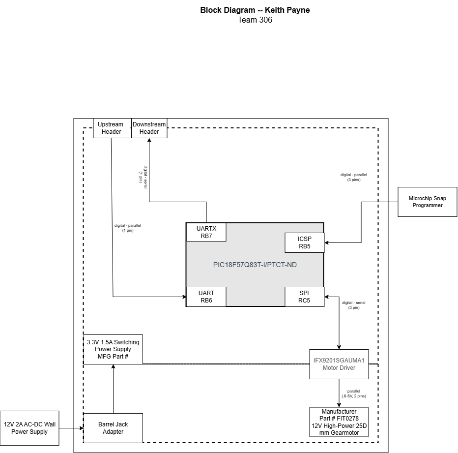

## Overview
This is currently my rough draft of my individual block diagram. My team is still unsure of what roles we are each playing and in what ways we want to connect with each other. For the moment I am responsible for a motor driver and two motors. Parts have yet to be selected as well as ports due to the nature of my
teams situation as we are still discussing how we want to connect with each other.

* I plan to use a 3.3V power supply for all controllers and sensors. a 12V adapter will be used to power motors separately.
* I will not have a sensor, but will utilize a motor driver.
* I will control 2 gear motors
* Our team will connect via wifi and ribbon cables.
* We plan on utilizing an on board battery power bank.

## My Role
My block diagram fits my role within my team structure as I am capable of recieving and transmitting information via the upstream and downstream headers. These signals are processed within the central PIC chip which then instructs the motor driver to power my DC motor. This motor will actuate clockwise and counter clockwise while attached to a drill bit to meet my teams actuation requirement.

## Block Diagram 

