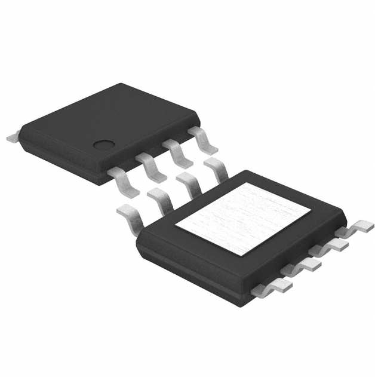
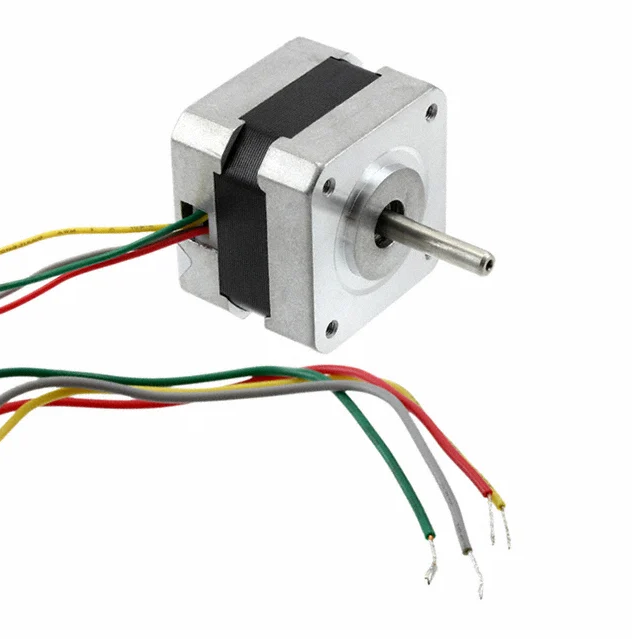

## Module's Selected Major Components

The following sections are the selected major components necessary for the drilling module I am designing for the teams rover.

### Power Management

1. LM2575T-3.3G switching regulator

   

   * $2.50 each
   * [link to product](https://www.digikey.com/en/products/detail/onsemi/LM2575T-3-3G/1476700)
  
    | Pros                                      | Cons                                                             |
    | ----------------------------------------- | ---------------------------------------------------------------- |
    | Inexpensive                               | Multiple pins required for operation                             |
    | Already have experince using this part    | Easy to break                                                    |
    | Supplied in class                         |                                                                  |

2. BD9859EFJ-E2 switching regulator

   

   * $0.60 each
   * [link to product](https://www.digikey.com/en/products/detail/rohm-semiconductor/BD9859EFJ-E2/4625605?s=N4IgjCBcoKwOwGYqgMZQGYEMA2BnApgDQgD2UA2iAJxwAsADEgLrEAOALlCAMrsBOASwB2AcxABfYmFpwI0EGkhY8RUhRAAmWlTCyQLEBy69BoiZJAxkhqGDasoGmOPFA)
  
    | Pros                                      | Cons                                                             |
    | ----------------------------------------- | ---------------------------------------------------------------- |
    | Inexpensive                               | Difficult to surface mount                                       |
    | Small size                                | Unideal Tolerances                                               |
    |                                           |                                                                  |

3. TPS61021ADSGR switching regulator

   

   * $1.38 each
   * [link to product](https://www.digikey.com/en/products/detail/texas-instruments/TPS61021ADSGR/6123255)
  
    | Pros                                      | Cons                                                             |
    | ----------------------------------------- | ---------------------------------------------------------------- |
    | Good Brand                                | Difficult to surface mount                                       |
    | Small size                                | slightly below target voltage                                    |
    | adjustable output                         |                                                                  |

   
**Rationale** The LM2575T-3.3G switching regulator is my choice as its inexpensive and easy to replace. I have used it in labs and found it to be reliable when compared to other parts and meets class criteria.

**Motor Driver's**

1. IFX9201SGAUMA1

    

    * $3.55/each
    * [link to product](https://www.digikey.com/en/products/detail/infineon-technologies/IFX9201SGAUMA1/5415542)

    | Pros                                      | Cons                                                             |
    | ----------------------------------------- | ---------------------------------------------------------------- |
    | Already Owned and Soldered                | Requires external components and support circuitry for interface |
    | Compatible with PSoC                      | requires more than 3.3V                                          |
    | Meets surface mount constraint of project |

2. AP1013CEN

    

    * $0.88/each
    * [link to product](https://www.digikey.com/en/products/detail/asahi-kasei-microdevices-akm/AP1013CEN/5182224)

    | Pros                                      | Cons                                                             |
    | ----------------------------------------- | ---------------------------------------------------------------- |
    | Very inexpensive                          | Unsure of reliability                                            |
    | Small size                                | Lacks ESP32 Compatibility                                        |
    |                                           | difficult pin layout                                             |

3. A3909GLYTR-T

    

    * $1.43/each
    * [link to product](https://www.digikey.com/en/products/detail/allegro-microsystems/A3909GLYTR-T/3979656)

    | Pros                                      | Cons                                                             |
    | ----------------------------------------- | ---------------------------------------------------------------- |
    | simple design                             | Unsure of reliability                                            |
    | easy to replace                           | Lacks ESP32 Compatibility                                        |
    | Similar to ones used in class             |                                                                  |

**Rationale:** The IFX9201SGAUMA1 is my choice as I have hands on experince using it in labs, as well as already having soldered it. This part is also confirmed to be compatible with our other resources.

**Motor's**

1. FIT0278

    

    * $13.95/each
    * [link to product](https://www.digikey.com/en/products/detail/dfrobot/FIT0278/6588458)

    | Pros                                      | Cons                                                             |
    | ----------------------------------------- | ---------------------------------------------------------------- |
    | Simple connections                        | expensive                                                        |
    | operates on 3.3V                          | slow speed                                                       |
    | Very accurate                             |                                                                  |

2. 108990003

    

    * $4.50/each
    * [link to product](https://www.digikey.com/en/products/detail/seeed-technology-co-ltd/108990003/5487797)

    | Pros                                      | Cons                                                             |
    | ----------------------------------------- | ---------------------------------------------------------------- |
    | Simple connections                        | needs 5V                                                         |
    | inexpensive                               | too small for current plans                                      |
    |                                           | low torque                                                       |

3. 324

    

    * $14.00/each
    * [link to product](https://www.digikey.com/en/products/detail/adafruit-industries-llc/324/5022791)

    | Pros                                      | Cons                                                             |
    | ----------------------------------------- | ---------------------------------------------------------------- |
    | Simple connections                        | needs 12V                                                        |
    | Reliable                                  | Heavy                                                            |
    | high torque                               |                                                                  |

