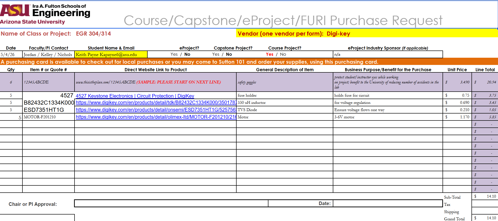

## Overview
Below is my Bill of Materials placed at ASU for order. Many of my components such as the PIC and motor driver were supplied and available in class.
Spools of resistors and capacitors were also avaliable so only items I did not have direct access too were ordered.

## Bill of Materials
{style width: "2000"}
**Figure 01:** Example Bill of Materials as a screenshot.

## Resouce

The Bill of Material as a PDF download is available [*here*](BOM_KP.pdf).
