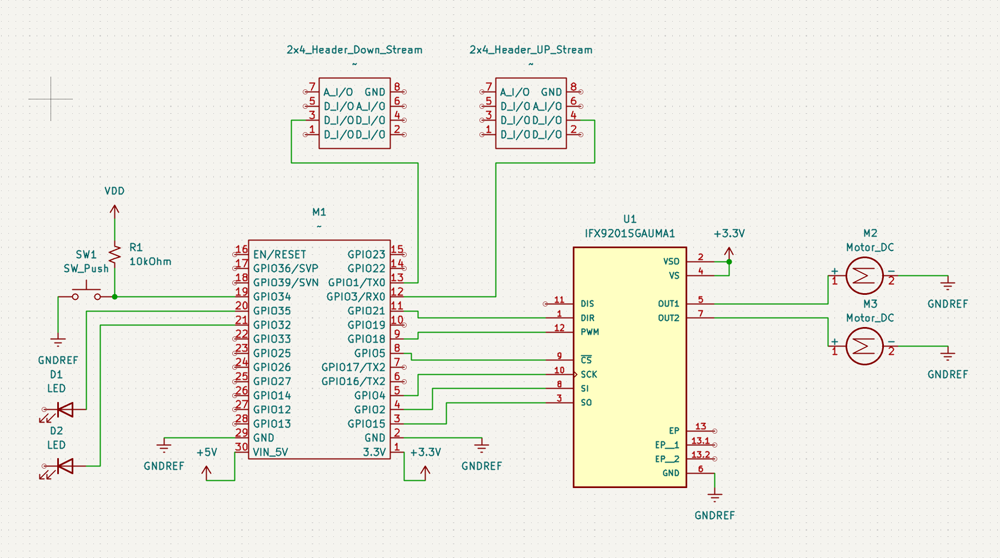

## Overview

This schematic is design to support a drilling rig on a rover as well as a mechanical arm to reposition the drill.

{style width:"350" height:"300;"}
**Figure 01:** Showing REV#1 of the schematic.

## Resouces

The schematic as a PDF download is available [*here*](ExampleSchematic.pdf), and the Zip folder of the project [*here*](dummyZip.zip).
