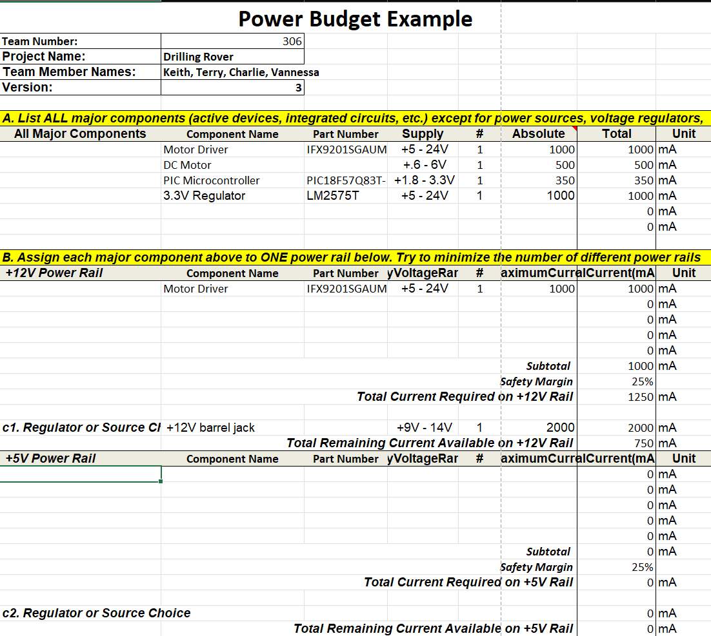
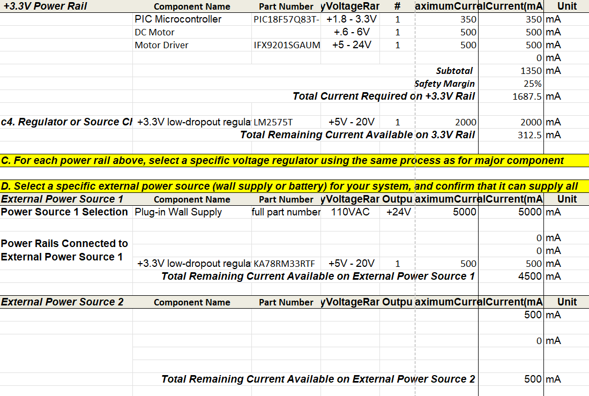

## Power Budget

Download the Power Budget Excel file [*here*](Power_Budget_KP.xlsx)

## How The Power Budget Was Used
Using the power budget allowed me to ensure all components could be powered long term from a 12V DC wall outlet.
This allowed me to design a system capable of powering a microcontroller, a motor driver and a DC motor all
within the same PCB from a single power source.
